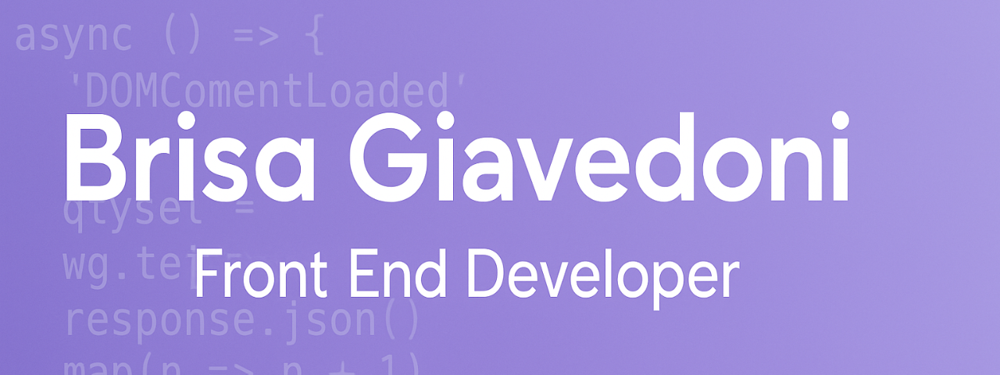

  

<h2 align="center">¡Hola! Soy Brisa 👋</h2>

  Desarrolladora web en formación, enfocada en el <strong>frontend</strong>. Apasionada por crear experiencias accesibles, modernas y centradas en el usuario.

---

## 💡 Sobre mí

- 👩‍💻 Actualmente formándome como **desarrolladora web**, con especial interés en **HTML, CSS y JavaScript**.
- 🚀 Me gusta aprender haciendo: aplico lo que estudio en proyectos reales y desafíos prácticos.
- 🎯 Enfocada en construir interfaces accesibles, limpias y con buena experiencia de usuario.
- 🧩 Participé en un hackathon desarrollando un módulo de gestión en **Odoo 18**.

---

## 🛠️ Tecnologías y herramientas

  
  
  
  
  
  
  

---

## 🚀 Proyectos destacados

🔹 [**Frontend-ADA**](https://github.com/BrisaGiavedoni/Frontend-ADA)  
📚 Prácticas front-end con HTML, CSS y JavaScript.

🔹 [**modulo-estacionamiento-odoo18**](https://github.com/BrisaGiavedoni/modulo-estacionamiento-odoo18)  
🚗 Módulo de gestión de estacionamiento en **Odoo 18** – Proyecto para hackathon.

🔹 [**Integrador_Final_ADA**](https://github.com/BrisaGiavedoni/Integrador_Final_ADA)  
📖 Sistema de gestión de biblioteca usando JavaScript.

🔹 [**ADA-TRABAJOS**](https://github.com/BrisaGiavedoni/ADA-TRABAJOS)  
📝 Ejercicios y prácticas realizadas durante mi formación.

---

## 📊 GitHub Stats

  
  

---

## 📌 Actividad reciente

- 📝 Actualicé el `README.md` – *25 de julio, 2025*  
- 💻 Subí clase 2 y ejercicios en Frontend-ADA – 10 de Septiembre, 2025*  
- 🚀 Creé el repositorio `modulo-estacionamiento-odoo18` – *14 de julio, 2025*

---

## 🎯 Actualmente

- Aprendiendo en profundidad **HTML, CSS y JavaScript**.
- Buscando mi **primera experiencia laboral** en tecnología 💼.
- Abierta a **colaboraciones**, prácticas o proyectos donde pueda aportar y seguir creciendo 🤝.

---

## 📬 Contacto

  
  
  

---

  ✨ ¡Gracias por visitar mi perfil! ✨  

